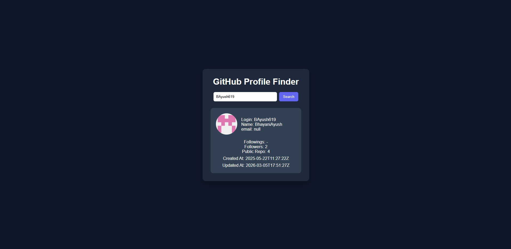
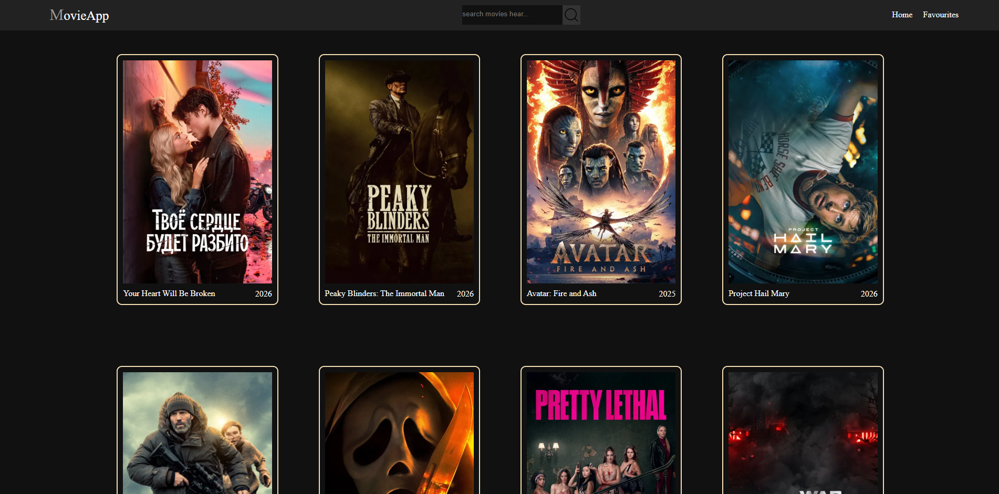
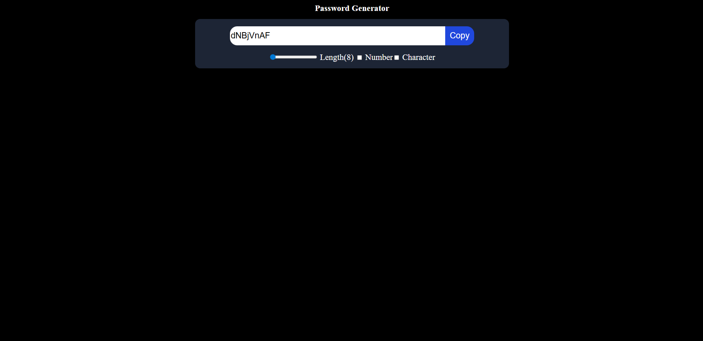
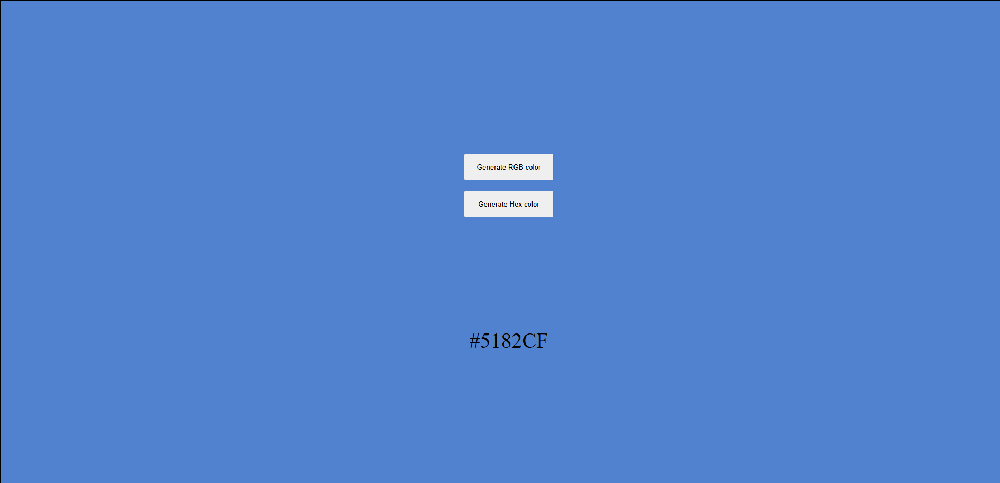
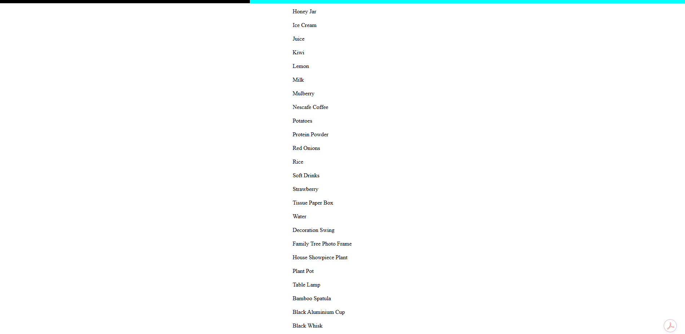
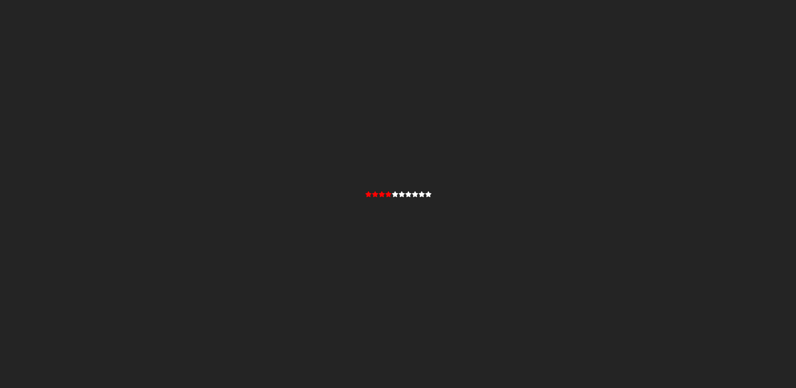
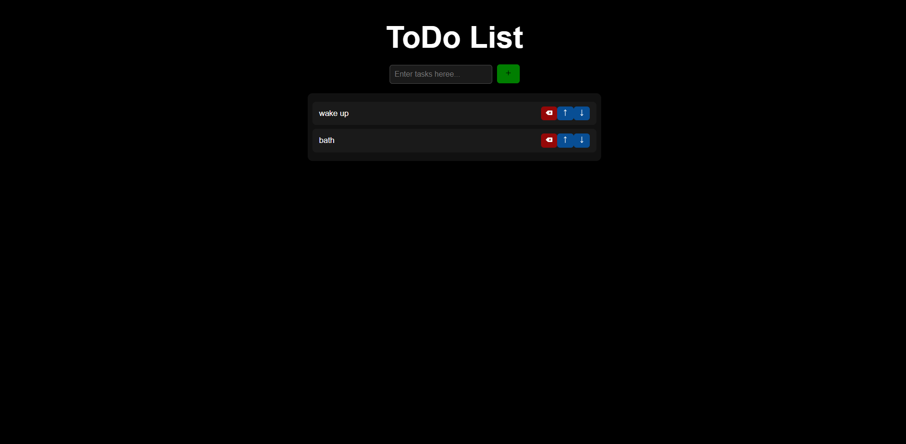

Frontend Mini Projects Collection

A collection of multiple frontend mini projects built using HTML, CSS, JavaScript, and React.
This repository contains small applications and UI components designed to practice frontend development concepts, state management, API integration, and interactive UI design.

Each project focuses on solving a specific UI problem and helps strengthen practical development skills.

Projects Included

The repository currently includes the following projects:
→Accordion

→Calculator

→Currency Converter

→Expense Tracker

→GitHub Profile Finder

→Image Slider

→Light / Dark Mode Toggle

→Menu Tree

→Movie App

→Password Generator

→Random Color Generator

→Star Rating Component

→To-Do App

Each project is built independently to demonstrate a particular concept or functionality in frontend development.

# Projects

## 1. Accordion

### Features

* Expand and collapse FAQ-style accordion items.
* Single selection mode – only one item can be opened at a time.
* Multiple selection mode – users can open multiple accordion items simultaneously.
* Toggle button to switch between single and multiple selection modes.
* Clicking an already opened item closes it automatically.
* Dynamic rendering of questions and answers from a data array.
* Simple and responsive UI for displaying expandable content.

### Tech Stack

* React.js – Component-based UI development
* React Hooks
* useState for state management
* CSS3 – Styling the accordion layout
* HTML5 – Structure of components

---

## 2. Calculator

### Features

* Perform basic arithmetic operations (+, −, ×, ÷)
* Real-time display of input and results
* Clear (C) button to reset calculations
* Evaluate expressions using =
* Dynamic rendering of buttons using React
* Simple and user-friendly interface

### Tech Stack

* React.js
* useState (React Hooks)
* CSS Modules
* HTML5

---

## 3. Currency Converter

### Features

* Convert between multiple currencies in real-time
* Fetch live exchange rates from API
* Swap currencies with a single click
* Automatic conversion when input or currency changes
* Loading spinner while fetching data
* Clean and user-friendly UI

### Tech Stack

* React.js
* React Hooks (useState, useEffect)
* Exchange Rate API
* CSS3
* HTML5

### Dark Mode Toggler (Work in Progress)

* Toggle button UI created
* Dark mode state management not implemented yet
* Theme switching logic (light/dark) pending
* CSS integration for dark mode is under development

---

## 4. Expense Tracker

### Features

<!-- continue -->

* Add expenses with category & amount
* Input validation (no empty or invalid values)
* Auto calculation of total spent
* Remaining balance based on budget
* Set & reset monthly budget
* Clean and simple UI

### Tech Stack

* React.js
* useState, useContext
* Context API
* CSS Modules

---

## 5. GitHub Profile Finder

### Features

* Search GitHub users by username
* Fetch real-time data from GitHub API
* Display profile info (name, login, avatar)
* Show followers, following, and repositories
* Handles missing data gracefully
* Simple and clean UI

### Tech Stack

* React.js
* useState, useEffect
* Fetch API
* CSS3
* HTML5

---

## 6. Image Slider

### Features

* Fetch images from API dynamically
* Left & right navigation controls
* Infinite looping (circular navigation)
* Clickable indicators (dots)
* Active image highlighting
* Smooth and simple UI

### Tech Stack

* React.js
* useState, useEffect
* Fetch API
* React Icons
* CSS3

---

## 7. Light / Dark Mode Toggle

### Features

* Toggle between light and dark mode
* Persist theme using localStorage
* Custom hook for reusable logic
* Dynamic class-based styling
* Simple and clean UI

### Tech Stack

* React.js
* useState, useEffect
* Custom Hook (useLocalStorage)
* LocalStorage API
* CSS3

---

## 8. Menu Tree

### Features

* Dynamic nested menu rendering
* Expand / collapse items (+ / - toggle)
* Recursive component structure
* Handles multi-level hierarchy
* Clean sidebar UI

### Tech Stack

* React.js
* useState
* Recursive Components
* CSS3

---

## 9. Movie App

### Features

* Fetch popular movies from TMDB API
* Display movie posters, titles, and release year
* Responsive movie grid layout
* Basic routing (Home & Favourites)
* Search bar UI (mobile & desktop)
* Uses TMDB API key via .env file

### Tech Stack

* React.js
* React Router
* useState, useEffect
* Fetch API
* CSS3

---

## 10. Password Generator

### Features

* Generate random passwords
* Adjustable password length (8–40)
* Option to include numbers
* Option to include special characters
* Copy to clipboard functionality
* Auto-generate on setting change

### Tech Stack

* React.js
* useState, useEffect
* CSS3

---

## 11. Random Color Generator

### Features

* Generate random HEX colors
* Generate random RGB colors
* Dynamic background color update
* Display generated color code
* Simple and interactive UI

### Tech Stack

* React.js
* useState
* JavaScript (Math.random)
* CSS3

---

## 12. Scroll Indicator

### Features

* Fetch and display products from API
* Scroll progress indicator (top progress bar)
* Real-time scroll percentage tracking
* Dynamic width update based on scroll
* Smooth and simple UI

### Tech Stack

* React.js
* useState, useEffect
* Fetch API
* DOM Scroll APIs
* CSS3

---

## 13. Star Rating Component

### Features

* Interactive star rating system
* Hover preview before selection
* Click to set rating
* Dynamic number of stars
* Active/inactive star styling

### Tech Stack

* React.js
* useState
* React Icons
* CSS3

---

## 14. To-Do App

### Features

* Add new tasks
* Delete tasks
* Move tasks up & down
* Prevent empty task input
* Dynamic task list rendering
* Empty state handling using Context API

### Tech Stack

* React.js
* useState, Context API
* React Icons
* CSS3
