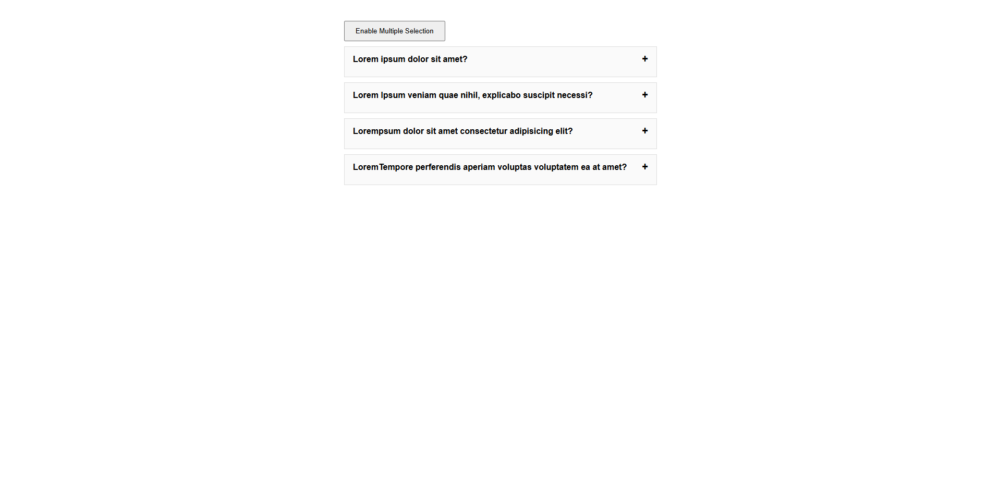
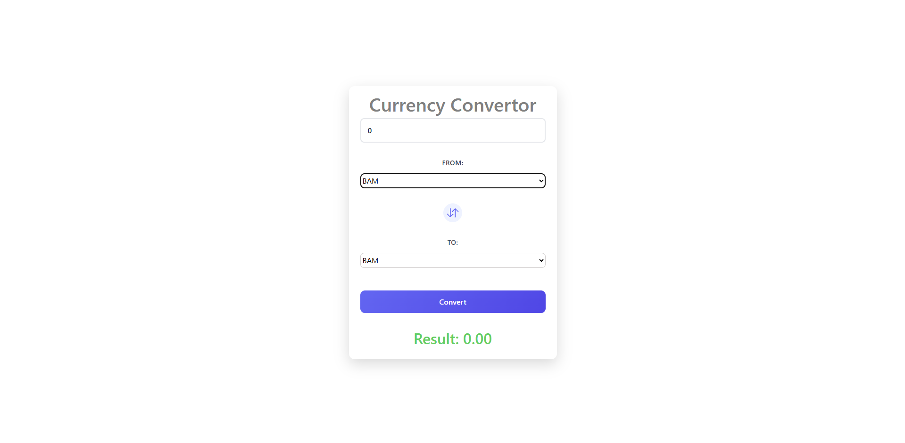
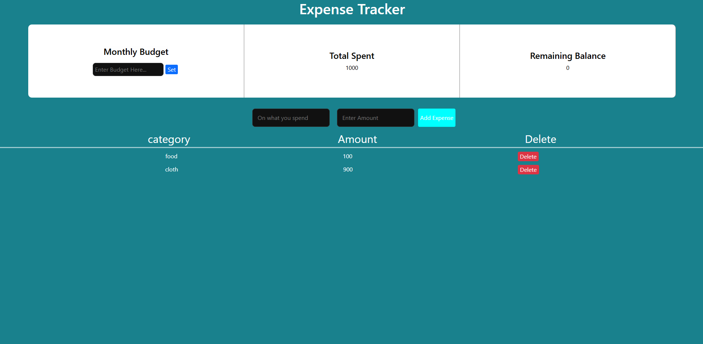

Frontend Mini Projects Collection

A collection of multiple frontend mini projects built using HTML, CSS, JavaScript, and React.
This repository contains small applications and UI components designed to practice frontend development concepts, state management, API integration, and interactive UI design.

Each project focuses on solving a specific UI problem and helps strengthen practical development skills.

Projects Included

The repository currently includes the following projects:
→Accordion

→Calculator

→Currency Converter

→Expense Tracker

→GitHub Profile Finder

→Image Slider

→Light / Dark Mode Toggle

→Menu Tree

→Movie App

→Password Generator

→Random Color Generator

→Star Rating Component

→To-Do App

Each project is built independently to demonstrate a particular concept or functionality in frontend development.

# Projects

## 1. Accordion

### Features

* Expand and collapse FAQ-style accordion items.
* Single selection mode – only one item can be opened at a time.
* Multiple selection mode – users can open multiple accordion items simultaneously.
* Toggle button to switch between single and multiple selection modes.
* Clicking an already opened item closes it automatically.
* Dynamic rendering of questions and answers from a data array.
* Simple and responsive UI for displaying expandable content.

### Tech Stack

* React.js – Component-based UI development
* React Hooks
* useState for state management
* CSS3 – Styling the accordion layout
* HTML5 – Structure of components

---

## 2. Calculator

### Features

* Perform basic arithmetic operations (+, −, ×, ÷)
* Real-time display of input and results
* Clear (C) button to reset calculations
* Evaluate expressions using =
* Dynamic rendering of buttons using React
* Simple and user-friendly interface

### Tech Stack

* React.js
* useState (React Hooks)
* CSS Modules
* HTML5

---

## 3. Currency Converter

### Features

* Convert between multiple currencies in real-time
* Fetch live exchange rates from API
* Swap currencies with a single click
* Automatic conversion when input or currency changes
* Loading spinner while fetching data
* Clean and user-friendly UI

### Tech Stack

* React.js
* React Hooks (useState, useEffect)
* Exchange Rate API
* CSS3
* HTML5

### Dark Mode Toggler (Work in Progress)

* Toggle button UI created
* Dark mode state management not implemented yet
* Theme switching logic (light/dark) pending
* CSS integration for dark mode is under development

---

## 4. Expense Tracker

### Features

<!-- continue -->

* Add and remove transactions
* Track income and expenses
* Dynamic balance calculation
* Simple financial overview

### Tech Stack

* React
* JavaScript
* CSS

---

## 5. GitHub Profile Finder

### Features

* Search GitHub users by username
* Fetch profile data from API
* Display repositories and profile info
* Clean profile UI

### Tech Stack

* React
* JavaScript
* CSS
* GitHub REST API

---

## 6. Image Slider

### Features

* Navigate through images
* Next and previous controls
* Smooth transition effects
* Responsive slider layout

### Tech Stack

* React
* JavaScript
* CSS

---

## 7. Light / Dark Mode Toggle

### Features

* Toggle between light and dark themes
* Persist theme preference
* Smooth UI theme switching
* Uses CSS variables for theme control

### Tech Stack

* React
* JavaScript
* CSS
* Local Storage API

---

## 8. Menu Tree

### Features

* Nested menu structure
* Expandable and collapsible nodes
* Dynamic rendering of menu items
* Recursive component implementation

### Tech Stack

* React
* JavaScript
* CSS

---

## 9. Movie App

### Features

* Fetch movie data from API
* Search movies by title
* Display movie posters and details
* Responsive movie grid layout

### Tech Stack

* React
* JavaScript
* CSS
* Movie Database API (TMDB or similar)

---

## 10. Password Generator

### Features

* Generate strong random passwords
* Adjustable password length
* Include/exclude character types
* Copy password to clipboard

### Tech Stack

* React
* JavaScript
* CSS

---

## 11. Random Color Generator

### Features

* Generate random colors
* Display HEX and RGB values
* Interactive color generation
* Simple and responsive UI

### Tech Stack

* React
* JavaScript
* CSS

---

## 12. Scroll Indicator

### Features

* Displays page scroll progress
* Dynamic progress bar
* Updates while scrolling
* Lightweight implementation

### Tech Stack

* React
* JavaScript
* CSS

---

## 13. Star Rating Component

### Features

* Interactive star rating system
* Hover and click effects
* Dynamic rating selection
* Reusable component design

### Tech Stack

* React
* JavaScript
* CSS

---

## 14. To-Do App

### Features

* Add tasks
* Delete tasks
* Mark tasks as completed
* Simple task management interface

### Tech Stack

* React
* JavaScript
* CSS
